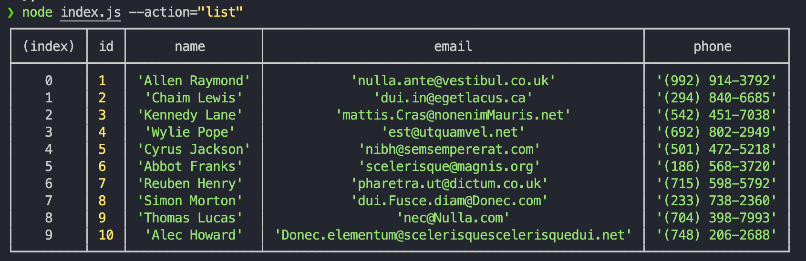
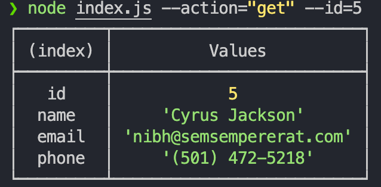
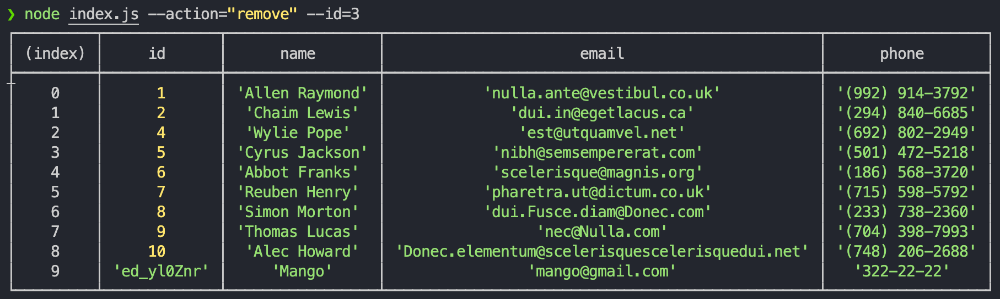

```sh
node index.js --action="list"
```



```sh
node index.js --action="get" --id=5
```



```sh
node index.js --action="add" --name="Mango" --email="mango@gmail.com" --phone="322-22-22"
```


```sh
node index.js --action="remove" --id=3
```


